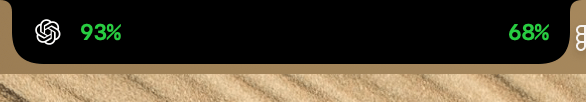
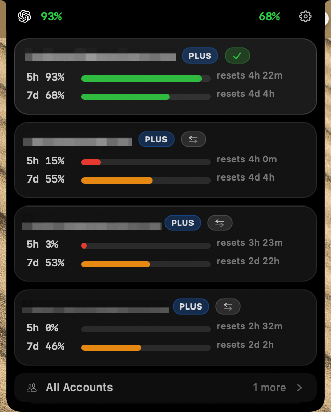
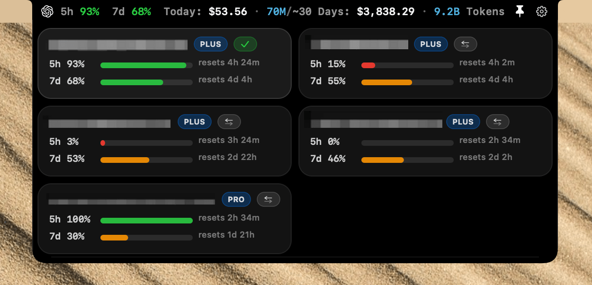
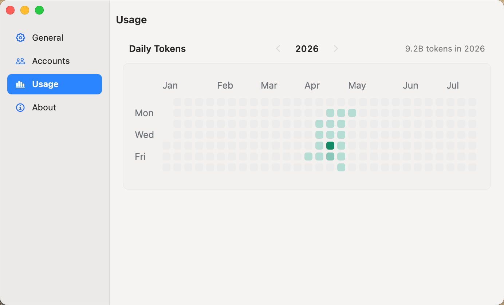
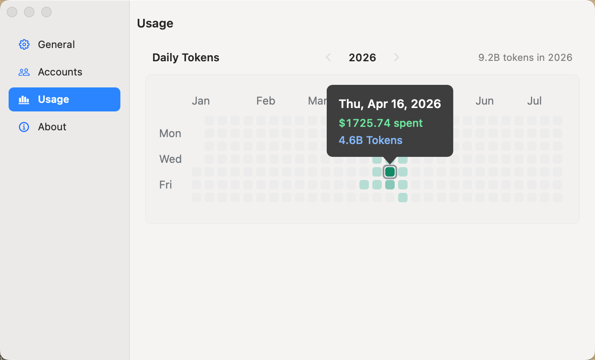

# Agent Bar

---

小而美的~~Vibe Coding~~（吸毒）记录仪，到 [Releases](https://github.com/iFurySt/agent-bar/releases) 下载使用。

## 截图

| 刘海屏精简岛 | 完整信息岛 |
| --- | --- |
|  |  |

| 刘海屏账号面板 | 宽屏账号面板 |
| --- | --- |
|  |  |

| Usage 热力图 | Usage 悬浮提示 |
| --- | --- |
|  |  |

## 许可证

[MIT](LICENSE)
